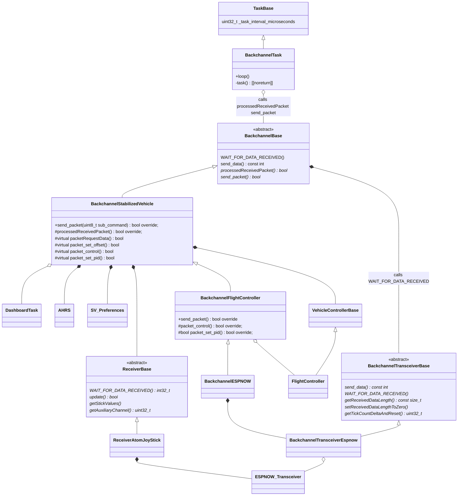

## Backchannel

This needs refactoring. In particular `BackchannelESPNOW` should not be derived from `BackchannelFlightController`.

```mermaid
classDiagram
    class BackchannelTransceiverBase {
        <<abstract>>
        send_data() const int *
        WAIT_FOR_DATA_RECEIVED() *
        getReceivedDataLength() const size_t *
        setReceivedDataLengthToZero() *
        getTickCountDeltaAndReset() uint32_t *
    }

    BackchannelTransceiverBase <|-- BackchannelTransceiverEspnow
    BackchannelTransceiverEspnow o-- ESPNOW_Transceiver

    class BackchannelBase {
        <<abstract>>
        WAIT_FOR_DATA_RECEIVED()
        send_data() const int
        processedReceivedPacket() bool *
        send_packet() bool *
    }
    BackchannelBase *-- BackchannelTransceiverBase : calls WAIT_FOR_DATA_RECEIVED

    class ReceiverBase {
        <<abstract>>
        WAIT_FOR_DATA_RECEIVED() int32_t *
        update() bool *
        getStickValues() *
        getAuxiliaryChannel() uint32_t *
    }
    ReceiverBase <|-- ReceiverAtomJoyStick
    class ReceiverAtomJoyStick
    ReceiverAtomJoyStick *-- ESPNOW_Transceiver

    BackchannelBase <|-- BackchannelStabilizedVehicle
    class BackchannelStabilizedVehicle {
        +send_packet(uint8_t sub_command) bool override;
        #processedReceivedPacket() bool override;
        #virtual packetRequestData() bool
        #virtual packet_set_offset() bool
        #virtual packet_control() bool
        #virtual packet_set_pid() bool
    }
    BackchannelStabilizedVehicle o-- DashboardTask
    BackchannelStabilizedVehicle *-- AHRS
    BackchannelStabilizedVehicle *-- SV_Preferences
    BackchannelStabilizedVehicle *-- ReceiverBase
    BackchannelStabilizedVehicle *-- VehicleControllerBase

    BackchannelStabilizedVehicle <|--BackchannelFlightController
    class BackchannelFlightController {
        +send_packet() bool override
        #packet_control() bool override;
        #bool packet_set_pid() bool override;
    }
    VehicleControllerBase <|-- FlightController
    BackchannelFlightController o-- FlightController

    BackchannelFlightController <|-- BackchannelESPNOW
    BackchannelESPNOW *-- BackchannelTransceiverEspnow


    class TaskBase {
        uint32_t _task_interval_microseconds
    }
    TaskBase <|-- BackchannelTask
    class BackchannelTask {
        +loop()
        -task() [[noreturn]]
    }
    BackchannelTask o-- BackchannelBase : calls processedReceivedPacket send_packet
```

