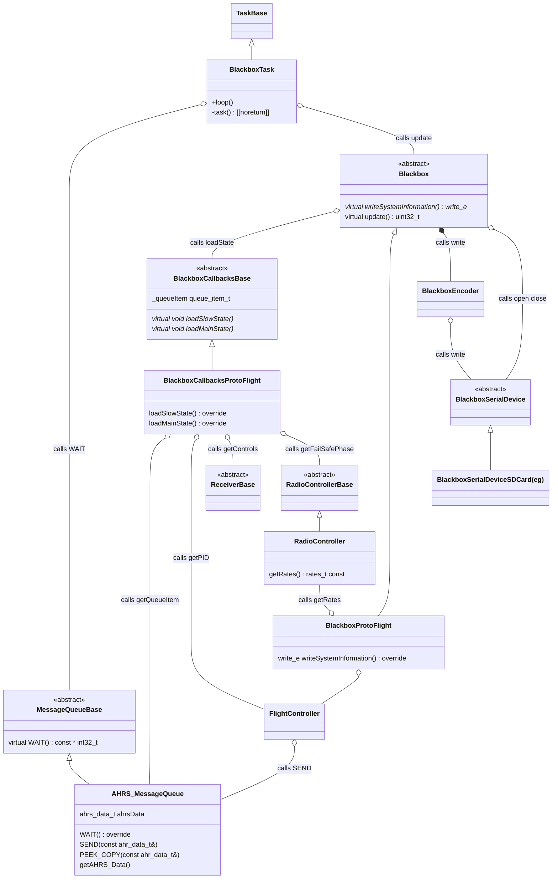

# Blackbox

`BlackboxProtoFlight` encodes system information (ie the header of the blackbox file) when blackbox is started.

`BlackboxCallbacksProtoFlight` encodes blackbox data during flight

All writing to the serial device is done via the `BlackboxEncoder`

