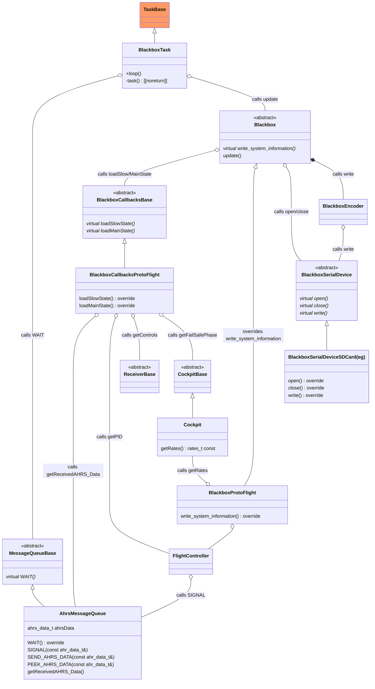
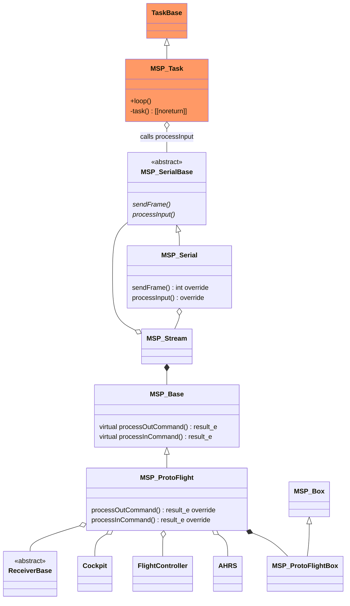
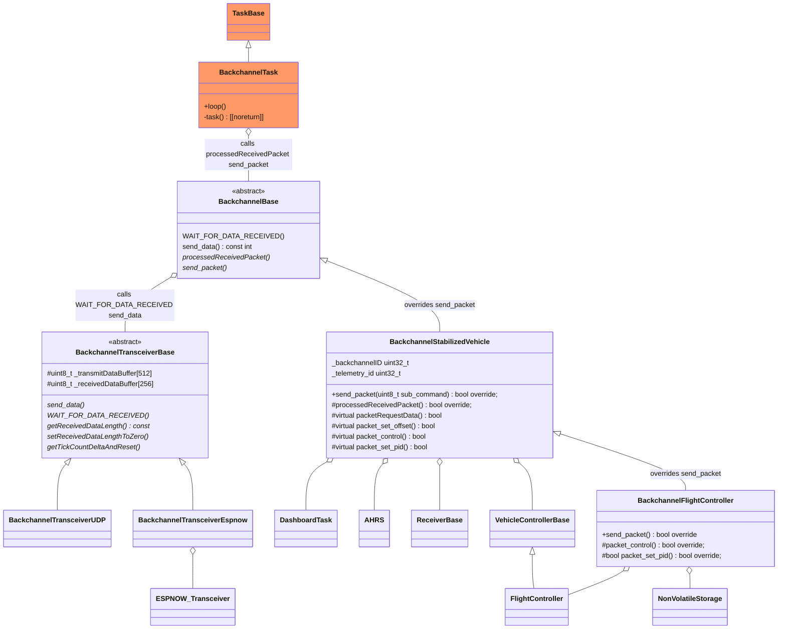
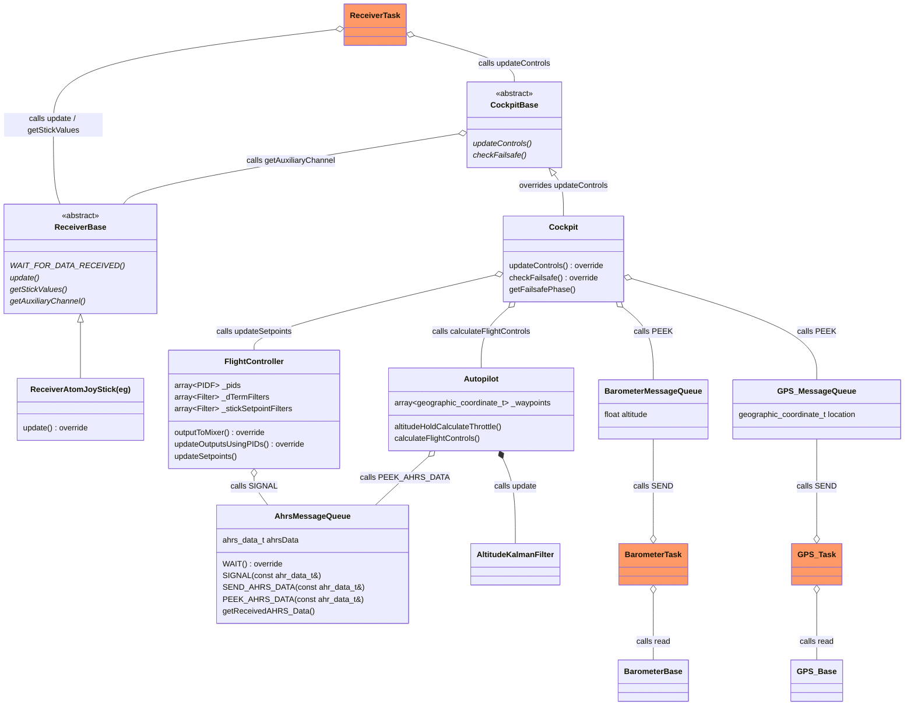

# Protoflight

Protoflight is flight control software.

It has the following design goals (in no particular order)

1. A modular design that is built up from components in separate libraries (see below).
2. Produce libraries that are usable in their own right.
3. Be peformant. Support 8kHz Gyro/PID loop time.
4. Support dual-core processors, in particular allow the Gyro/PID loop to have an entire core to itself.
5. Run on bare metal or under [FREERTOS](https://www.freertos.org/).
6. Be (relatively) easy to learn and modify.
7. Give users the ability implement their own code or modifications.
8. Modular architecture to make it easier to identify which bit of code to modify, without impacting other code.
9. Be useful to people who want to experiment with and customize a flight controller.
10. Be useful to someone who wants to understand how flight control software works.
11. Be Betaflight "Tool compatible". This is be able to use Betaflight Configurator and Betaflight Blackbox Explorer.

## Protoflight name

I've called it Protoflight because:

1. It can be used to prototype new ideas.
2. One of the meanings of "proto" is "primitive". This software is nowhere near as sophisticated as BetaFlight or ArduPilot.
3. It is related to "protean", meaning "able to change frequently or easily" or "versatile".
4. It pays homage to [Protea](https://en.wikipedia.org/wiki/Protea), which was the codename for the [Psion Series 5](https://en.wikipedia.org/wiki/Psion_Series_5)

## Libraries used to build Protoflight

1. [VectorQuaternionMatrix](https://github.com/martinbudden/Library-VectorQuaternionMatrix.git) - 3D Vectors, Quaternions, and 3x3 Matrices.
2. [TaskBase](https://github.com/martinbudden/Library-TaskBase.git) - base class for all tasks.
3. [Filters](https://github.com/martinbudden/Library-Filters.git) - various filters.
4. [PIDF](https://github.com/martinbudden/Library-PIDF.git) - PID (Proportional Integral Derivative) controller with optional feedforward and open loop control.
5. [Sensors](https://github.com/martinbudden/Library-Sensors.git) - gyroscopes, accelerometers, and barometers
6. [SensorFusion](https://github.com/martinbudden/Library-SensorFusion.git) - sensor fusion, including: Complementary Filter,
   Mahony Filter, Madgwick Filter, and Versatile Quaternion Filter (VQF).
7. [Stabilized Vehicle](https://github.com/martinbudden/Library-StabilizedVehicle.git) - AHRS (Attitude and Heading Reference System)
   and VehicleControllerBase (base class for stabilized vehicles).
8. [MotorMixers](https://github.com/martinbudden/Library-MotorMixers.git) MotorMixers. Converts desired throttle and roll, pitch, yaw torques into motor commands.
   Supports PWM and bidirectional DShot protocols. Also includes RPM filters and dynamic idle control.
9. [Receiver](https://github.com/martinbudden/Library-Receiver.git) - receiver base class and implementations, including implementation using [ESP-NOW](https://docs.espressif.com/projects/esp-idf/en/stable/esp32/api-reference/network/esp_now.html).
10. [Backchannel](https://github.com/martinbudden/Library-Backchannel.git) - backchannel over ESP-NOW for telemetry, PID tuning, and benchmarking.
11. [StreamBuf](https://github.com/martinbudden/Library-Filters.git) - simple serializer/deserializer with no bounds checking
12. [FlashKLV](https://github.com/martinbudden/Library-FlashKLV.git) - Flash Key Length Value (KLV) storage
13. [Blackbox](https://github.com/martinbudden/Library-Blackbox.git) - port of [implementation](https://github.com/thenickdude/blackbox) by
    Nicholas Sherlock (aka thenickdude).
14. [MultiWiiSerialProtocol](https://github.com/martinbudden/Library-MultiWiiSerialProtocol.git) (MSP) - ported from Betaflight MultiWiiSerialProtocol.

## Flight Controller design/software framework

The design/software framework has undergone a number of iterations and I don't expect to make any major changes to it. However it
is still somewhat in flux and I expect there will continue to be changes. In particular:

1. The Receiver class does not yet handle telemetry. Adding this may involve structural changes to the Receiver class and/or Receiver task.

## Protoflight Project

The Protoflight project is a "spare time" project: updates will be made when I have the time and inclination. The following are areas
that I, at some point, would like to tackle. In no particular order:

1. Implement DMA on ESP32 (DMA currently only working on RPI Pico).
2. Implement Backchannel over UDP. This would allow Backchannel to be used on RPI Pico2W.
3. Implement DShot on ESP32 (currently only implemented for RPI Pico).
4. Implement saving Blackbox to flash (currently only saves to SD-card)
5. Investigate filtering the output from the PIDs and/or the inputs to the motors.
6. Investigate new ways of handling PID integral windup.
7. Add On-screen display (OSD) with menu system.

## History of the Project

The core of this code was originally developed for a [Self Balancing Robot](https://github.com/martinbudden/SelfBalancingRobot.git) (SBR).

### Self Balancing Robot design decisions

One of the early design decisions for the SBR was to split the functionality into libraries, and make each of these libraries usable
in their own right. Two of the early libraries were the vector/quaternion library and the sensor fusion library. I named the 3D vector
class `xyz_t` rather than `Vector` to avoid any confusion with the C++ `vector` container class.

An SBR runs in "Angle Mode" all the time: what is being stabilized is the pitch angle. This means the the sensor fusion algorithm
runs every iteration of the "Gyro/PID loop". So the performance of the sensor fusion is critical. There are a number of Arduino
Madgwick Sensor fusion libraries, but they all seem to be copies of each other, presumably all copied from some original implementation.
This implementation was not particularly efficient, so I wrote my own optimized version.

It turns out that for yaw rate control on an SBR you don't need a PID controller - simple open loop control (ie setting the output
proportional to the setpoint) works fine. So rather than implement a separate open loop controller for yaw, I added what I then called
a feed forward component to the PID controller - that is a term that gave output proportional to the setpoint. (It turns out that
this is not the same as Betaflight feed forward, so this was later renamed).

My original SBR implementation was on an ESP32. So ESPNOW was used to implement the receiver. ESPNOW supports several what it calls "peers"
over a radio channel, so I decided to implement a "Backchannel" that could be used for telemetry and PID tuning.

The backchannel turned out to be incredibly useful for debugging, benchmarking, and seeing the PID values in realtime, so I decided
to run the "Gyro/PID loop" all the time, even when the motors are switched off. Of course you get terrible integral windup if the motors
are off so I added functions to the PID controller to turn PID integration on and off.

### Generalization of SBR code for use in a Flight Controller

While I was writing the code for the SBR  I realized that I had written virtually everything required for a Flight Controller.
The main new requirements were:

1. a MotorMixer that could handle output to the 4 propeller motors on a quadcopter rather than the 2 wheel motors on an SBR
2. a flight controller that could stabilize the 3 axes of roll, pitch, and yaw, rather than the single axis of pitch on an SBR
3. a wider range of filters, since the vibrations on an SBR are not that severe and don't require too much filtering

So I split the `MotorPairController` I had written for the SBR into `VehicleControllerBase` and `MotorPairController` and used
`VehicleControllerBase` as a base class for a new `FlightController` class.

I originally developed the SBR on ESP32 hardware, and ESP32 has [FREERTOS](https://www.freertos.org/) built into its development software,
so it was natural to continue using FREERTOS.

It soon became clear that this rabbit hole was a bit deeper than I thought it would be.

A flight controller has many more parameters that need tuning that an SBR. The Backchannel I had developed for the SBR was very useful
for developing the FlightController, but it was not sufficient. Rather than spend a lot of effort in adding features to the Backchannel
I decided it would be better (and less effort) to port MultiWiiSerialProtocol and Blackbox from Betaflight. That way I could (in principle)
use the Betaflight configurator and Betaflight blackbox viewer. These ports are still in progress.

While porting the Blackbox and MSP I renamed and rearranged some of the Protoflight parameters -  this is ongoing.

While doing this port I also realized that the FeedForward in Betaflight was not the same as FeedForward in Protoflight.
Betaflight's FeedForward is proportional to the rate of change of the setpoint, whereas Protoflight's FeedForward was proportional
to the setpoint. So I changed the meaning of Protoflight's FeedForward, and added a new PID component (called 'S' for setpoint) which
is proportional to the setpoint. (Betaflight also has an 'S' component for PIDs, as far as I can tell this is only used for fixed wing
aircraft and is proportional to the setpoint.)

The project is still ongoing and has not yet achieved "first flight". The Self Balancing Robot has achieved "First Stabilized Drive"
so I am confident in all the lower layers of the software stack (that is libraries 1-10 listed above).

I currently have ports of the software to ESP32 and Raspberry Pi Pico, but not yet to STM32.

One of the reasons for concentrating on ESP32 and RPI Pico was that they both have dual-core versions available, and one of my
primary interests is that of having the `Gyro/PID` loop
(what I snappily call the `readIMUandUpdateOrientation/updateOutputsUsingPIDs` loop) having a whole core entirely to itself.
Protoflight will run on a single core, but I find the dual core setup more interesting.

### Running the PIDs in *Quaternion Space*

I have on occasion toyed with the idea of running the PIDs in *Quaternion Space*. That is, instead of having 3 PIDs (one for each of
roll, pitch, and yaw) a transformation would be applied to these PIDs, mapping them onto 4 PIDs in *Quaternion Space*, one PID for each of
w, x, y, and z.

The idea of operating in *Quaternion Space* is not without precedent: the Madgwick Sensor Fusion Filter can in some ways be regarded as
a Complementary Filter that operates in *Quaternion Space*.

However operating PIDs in *Quaternion Space* is problematic:

1. There is little advantage for controlling roll, pitch, and yaw rates.
2. There is some advantage in using it for controlling roll and pitch angles, but here we would then replace two PIDs by four PIDs
   negating some of that advantage.
3. The mapping of PIDs in Euler Angle Space to PIDs in Quaternion Space is by no means obvious.
4. PID tuning in Quaternion Space is likely to be complicated.

I realized that there is an intermediate space between *Euler Angle Space* and *Quaternion Space*: the space defined by the sine of the
Euler Angles. So the measurement input to the rollAngle PID would be not the *rollAngle*, but would be *sin(rollAngle)*. And the setpoint
of the rollAngle PID would not be the *desiredRollAngle*, but *sin(desiredRollAngle)* (and likewise for pitchAngle). This would avoid using the
computationally expensive use of `Quaternion::calculateRollDegrees()` and `Quaternion::calculateRollDegrees()`, instead you could
use `Quaternion::sinRoll()` and `Quaternion::sinPitch()` which are relatively cheap computationally.

But, I hear you say, you've just replaced the computationally expensive `Quaternion::calculateRollDegrees()` with `sinf(desiredRollAngle)`
so there is little benefit. This is true, but `sinf(desiredRollAngle)` only changes when a new stick value is received, and so can be
calculated in the Receiver Task.

What about the fact that *sin(rollAngle)* is a non-linear function of *rollAngle*? Well, PIDs deal with non-linear systems all the time, so
I don't think that will be a problem. There also remains the possibility of changing the "rates" to compensate for this, if necessary.

Since the "*intermediate between Euler Angle and Quaternion space*" is a bit of a mouthful, and this intermediate space is closer to
*Quaternion Space* than *Euler Angle Space*, I'm takings some programmer's license and using the term *Quaternion Space* for this space.

Preliminary benchmarks (on an ESP32 S3 running at 240MHz) that the angle mode PID calculations take 80 microseconds with running in
*Euler Angle Space* and 50 microseconds in *Quaternion Space*. By alternatively calculating the roll angle values and pitch angle values
in each iteration of the control loop, the *Quaternion Space* calculation is reduced to 25 microseconds. This means it is feasible
to do the angle mode stabilization in the main control loop, even when it is running at 8kHz. Feasible doesn't mean possible, but this
is certainly worth investigating. For a 4kHz control loop this certainly seems possible.

## Description of Main Control Loop

This is a description of the Main Control Loop, often called the "Gyro/PID loop".
The there are variations in this loop depending on the hardware configuration, this describes operation for "ideal" hardware, namely:

1. IMU connected via SPI, with interrupt pin connected
2. IMU capable of 8kHz update frequency
3. IMU that can be read in little-endian format
4. Dual-core processor with floating point unit (FPU)

The heart of the loop is the `AHRS::readIMUandUpdateOrientation` function, invocation is as follows:

1. The IMU generates a new reading and sets its interrupt pin.
2. The IMU device driver ISR (interrupt service routine) is called and it initiates a read of the IMU via DMA (direct memory access).
3. The DMA completes. The IMU device driver converts the raw IMU data into real world units, taking into account the IMU orientation
   within the aircraft frame.
4. The IMU device driver signals the AHRS task that there is a new IMU value available by putting the IMU reading in a shared message queue
5. The AHRS task receives the signal, gets the IMU value from the shared message queue, and calls the `AHRS::readIMUandUpdateOrientation` function.
6. **THE CLOCK STARTS NOW**. For an **8kHz** update frequency we have **125 microseconds** (see NOTE A) to complete all the following steps,
   *(Timings for each step in microseconds on an 240MHz ESP32 S3 are given where available)*.
7. The AHRS gets the IMU reading from the IMU device.
8. The AHRS filters the IMU reading, using the RPM filters and all other filters *(1st harmonic only:15us(max19),1st+3rd:21us)* (see NOTE B).
9. The AHRS calculates the current orientation using sensor fusion of the gyro and accelerometers values *(20us)*.
10. The AHRS calls `FlightController::updateOutputsUsingPIDs` passing the gyro, accelerometer and orientation values *(acroMode:20us,angleModeQuaternionSpace:50us,angleModeEulerAngleSpace:80us)*.
11. If the blackbox is active, data is copied to the blackbox message queue for logging by the Blackbox task.

NOTE A: strictly speaking we don't have the full 125 microseconds - step 3 also uses a few microseconds of this time
(which is why it is preferable to have an IMU that can be read in little-endian format - this avoids the need for byte reordering).

NOTE B: the RPM filter frequencies are set in the FlightController task in the `FlightController::outputToMixer` function. This function
calls `MotorMixer::outputToMotors` which calculates the motor mix, writes the outputs to the motors, reads the motor RPMs, and then sets
the RPM filter frequencies.

NOTE C: steps 1-5 can be made more efficient when using a Raspberry Pi Pico and PIO, namely:

1. The IMU generates a new reading and sets its interrupt pin.
2. The PIO state machine that was waiting on the IMU interrupt PIN reads the IMU and puts the result in its TX FIFO.
3. The AHRS task which, was waiting on the PIO TX FIFO, gets the IMU value and calls the `AHRS::readIMUandUpdateOrientation` function.

This avoids both the ISR and the shared message queue.

## UML Diagrams

UML Diagrams have become somewhat unfashionable. But I like them.
I agree that they have limited use in the design phase of a project, but I find they are very useful to document a design.
The process of documenting a design can reveal subtleties that were overlooked, and indeed I found that when documenting Protoflight.

## Simplified Class Structure

The `Cockpit` is the command center for the aircraft.

All objects are statically allocated in `Main::setup()`.

When the hardware supports it `AHRS_Task` and `Receiver_Task` are interrupt-driven.
`VehicleController_Task` is  triggered when `AHRS::readIMUandUpdateOrientation` completes.

Classes with *"(eg)"* suffix give examples of specific instances.

On dual-core processors `AHRS_Task` has the entire second core to itself.

## Simplified Task Structure

The `AHRS_Task` and the `ReceiverTask` may be either interrupt driven or timer driven. 

On a dual-core processor `AHRS_Task` has the second core all to itself.

Tasks are statically (build-time) polymorphic, not dynamically (run-time) polymorphic.
They all have `task` and `loop` functions, but these functions are not virtual.
This is deliberate.

`BackchannelTask`, `BlackboxTask`, `DashboardTask`, and `MSP_Task` are optional tasks and are not required for flight.

Task synchronization primitives are shown in CAPITALS, ie WAIT/SIGNAL

In the case where `AHRS_Task` and `ReceiverTask` are interrupt driven, we have:

1. The `AHRS_Task` waits on the `IMU` which signals it whenever the IMU has a new data reading (typically this occurs at 1kHz to 8kHz)
2. The `ReceiverTask` waits on the `Receiver` which signals it whenever it receives a data packet (typically this occurs at 20Hz to 200Hz)
3. The `VehicleControllerTask` waits on the `VehicleController` which is signalled by the `AHRS` every `N` times it calls `updateOutputsUsingPIDs`,
   where `N` is configurable.
4. The `BlackboxTask` waits on the `AhrsMessageQueue`, which is signaled by the `AHRS` when it has new data. The `BlackboxTask`
   will write data to storage every `N` times it is called, where `N` is configurable.
5. The `BackchannelTask` is called on a timer.
6. The `MSP_Task` is called on a timer.

```mermaid
---
  config:
    class:
      hideEmptyMembersBox: true
---
classDiagram
    class TaskBase:::taskClass {
    }
    link TaskBase "https://github.com/martinbudden/Library-TaskBase/blob/main/src/task_base.h"
    TaskBase <|-- AHRS_Task
    TaskBase <|-- VehicleControllerTask
    TaskBase <|-- ReceiverTask
    TaskBase <|-- DashboardTask
    TaskBase <|-- BlackboxTask
    TaskBase <|-- BackchannelTask
    TaskBase <|-- MSP_Task

    class AHRS_Task:::taskClass {
    }
    link AHRS_Task "https://github.com/martinbudden/Library-StabilizedVehicle/blob/main/src/AHRS_Task.h"
    AHRS_Task o-- IMU_Base : calls WAIT_IMU_DATA_READY
    AHRS_Task --o IMU_Base : calls SIGNAL
    AHRS_Task o-- AHRS : calls readIMUandUpdateOrientation
    class ImuBase {
        <<abstract>>
        WAIT_IMU_DATA_READY()
        SIGNAL_IMU_DATA_READY_FROM_ISR()
        virtual readAccGyroRPS() accGyroRPS_t
    }
    link IMU_Base "https://github.com/martinbudden/Library-Sensors/blob/main/src/IMU_Base.h"

    IMU_Base <|-- IMU_BMI270 : overrides readAccGyroRPS
    class IMU_BMI270["IMU_BMI270(eg)"]
    link IMU_BMI270 "https://github.com/martinbudden/Library-Sensors/blob/main/src/IMU_BMI270.h"

    class ImuFiltersBase {
        <<abstract>>
        filter() *
    }
    link ImuFiltersBase "https://github.com/martinbudden/Library-StabilizedVehicle/blob/main/src/ImuFiltersBase.h"

    class DynamicNotchFilter {
        array~BiquadFilter~ notchFilters
        filter()
    }
    link DynamicNotchFilter "https://github.com/martinbudden/protoflight/blob/main/lib/FlightController/src/DynamicNotchFilter.h"

    class RPM_Filters {
        array~BiquadFilterT~xyz_t~~ _filters[MOTORS][HARMONICS]
        setFrequencyHzIterationStep()
        filter()
    }
    link RPM_Filters "https://github.com/martinbudden/protoflight/blob/main/lib/FlightController/src/RPM_Filters.h"

    class IMU_Filters {
        FilterT~xyz_t~  _gyroLPF
        BiquadFilterT~xyz_t~ _gyroNotch
        filter() override
    }
    link IMU_Filters "https://github.com/martinbudden/protoflight/blob/main/lib/FlightController/src/IMU_Filters.h"
    IMU_Filters o-- DynamicNotchFilter : calls filter
    IMU_Filters o-- RPM_Filters : calls filter
    ImuFiltersBase <|-- IMU_Filters : overrides filter

    class SensorFusionFilterBase {
        Quaternion orientation
        <<abstract>>
        updateOrientation() Quaternion *
    }
    link SensorFusionFilterBase "https://github.com/martinbudden/Library-SensorFusion/blob/main/src/sensor_fusion.h"

    SensorFusionFilterBase  <|-- MadgwickFilter : overrides updateOrientation
    class MadgwickFilter["MadgwickFilter(eg)"] {
        updateOrientation() override
    }
    link MadgwickFilter "https://github.com/martinbudden/Library-SensorFusion/blob/main/src/sensor_fusion.h"

    class AHRS {
        bool readIMUandUpdateOrientation()
    }
    link AHRS "https://github.com/martinbudden/Library-StabilizedVehicle/blob/main/src/ahrs.h"
    AHRS o-- IMU_Base : calls readAccGyroRPS
    AHRS o-- ImuFiltersBase : calls filter
    AHRS o-- SensorFusionFilterBase : calls updateOrientation
    AHRS o-- VehicleControllerBase : calls updateOutputsUsingPIDs / SIGNAL

    class VehicleControllerBase {
        <<abstract>>
        WAIT()
        SIGNAL()
        outputToMixer() *
        updateOutputsUsingPIDs() *
    }
    link VehicleControllerBase "https://github.com/martinbudden/Library-StabilizedVehicle/blob/main/src/vehicle_controller_base.h"

    class VehicleControllerTask:::taskClass {
    }
    link VehicleControllerTask "https://github.com/martinbudden/Library-StabilizedVehicle/blob/main/src/VehicleControllerTask.h"
    VehicleControllerTask o-- VehicleControllerBase : calls WAIT / outputToMixer

    class VehicleControllerMessageQueue {
        WAIT()
        SIGNAL()
    }
    link VehicleControllerMessageQueue "https://github.com/martinbudden/Library-StabilizedVehicle/blob/main/src/VehicleControllerMessageQueue.h"
    class MotorMixerBase {
        <<abstract>>
        outputToMotors() *
    }
    link MotorMixerBase "https://github.com/martinbudden/protoflight/blob/main/lib/MotorMixers/src/motor_mixer_base.h"

    class DynamicIdleController {
        calculateSpeedIncrease()
    }
    link DynamicIdleController "https://github.com/martinbudden/protoflight/blob/main/lib/MotorMixers/src/dynamic_idle_controller.h"

    class MotorMixerQuadX_DShot["MotorMixerQuadX_DShot(eg)"]
    link MotorMixerQuadX_DShot "https://github.com/martinbudden/protoflight/blob/main/lib/MotorMixers/src/MotorMixerQuadX_DShot.h"
    MotorMixerQuadX_DShot *-- RPM_Filters : calls setFrequencyHzIterationStep
    MotorMixerQuadX_DShot *-- DynamicIdleController : calls calculateSpeedIncrease

    MotorMixerBase <|-- MotorMixerQuadX_Base : overrides outputToMotors
    MotorMixerQuadX_Base <|-- MotorMixerQuadX_DShot : overrides getMotorFrequencyHz
    class MotorMixerQuadX_Base {
        array~float,4~ _motorOutputs
    }
    link MotorMixerQuadX_Base "https://github.com/martinbudden/protoflight/blob/main/lib/MotorMixers/src/MotorMixerQuadX_Base.h"

    class FlightController {
        array~PIDF~ _pids
        array~Filter~ _dTermFilters
        array~Filter~ _stickSetpointFilters
        outputToMixer() override
        updateOutputsUsingPIDs() override
        updateSetpoints()
    }
    link FlightController "https://github.com/martinbudden/protoflight/blob/main/lib/FlightController/src/FlightController.h"
    VehicleControllerBase *-- VehicleControllerMessageQueue : calls WAIT / SIGNAL
    VehicleControllerBase <|-- FlightController : overrides outputToMixer updateOutputsUsingPIDs
    FlightController o-- MotorMixerBase : calls outputToMotors

    class CockpitBase {
        <<abstract>>
        updateControls() *
        checkFailsafe() *
    }
    link CockpitBase "https://github.com/martinbudden/Library-Receiver/blob/main/src/CockpitBase.h"
    CockpitBase <|-- Cockpit : overrides updateControls

    class Cockpit {
        updateControls() override
        checkFailsafe() override
        getFailsafePhase()
    }
    link Cockpit "https://github.com/martinbudden/protoflight/blob/main/lib/Helm/src/Cockpit.h"
    Cockpit o-- FlightController : calls updateSetpoints
    Cockpit o-- Autopilot : calls calculateFlightControls

    class ReceiverTask:::taskClass {
    }
    link ReceiverTask "https://github.com/martinbudden/Library-Receiver/blob/main/src/ReceiverTask.h"

    ReceiverTask o-- CockpitBase : calls updateControls
    ReceiverTask o-- ReceiverBase : calls update / getStickValues
    ReceiverTask o-- ReceiverWatcher : calls newReceiverPacketAvailable

    class Autopilot {
        array~geographic_coordinate_t~ _waypoints
        altitudeHoldCalculateThrottle()
        calculateFlightControls()
    }
    link Autopilot "https://github.com/martinbudden/protoflight/blob/main/lib/Helm/src/Autopilot.h"
    Autopilot o-- AhrsMessageQueue : calls PEEK_AHRS_DATA

    class AhrsMessageQueue {
        ahrs_data_t ahrsData
        WAIT() override
        SIGNAL(const ahr_data_t&)
        SEND_AHRS_DATA(const ahr_data_t&)
        PEEK_AHRS_DATA(const ahr_data_t&)
        getReceivedAHRS_Data()
    }
    link AhrsMessageQueue "https://github.com/martinbudden/Library-StabilizedVehicle/blob/main/src/AhrsMessageQueue.h"
    FlightController o-- AhrsMessageQueue : calls SIGNAL

    class ReceiverBase {
        <<abstract>>
        WAIT_FOR_DATA_RECEIVED() *
        update() *
        getStickValues() *
        getAuxiliaryChannel() *
    }
    link ReceiverBase "https://github.com/martinbudden/Library-Receiver/blob/main/src/ReceiverBase.h"
    class ReceiverAtomJoyStick {
        update() override
    }
    ReceiverBase <|-- ReceiverAtomJoyStick
    class ReceiverAtomJoyStick["ReceiverAtomJoyStick(eg)"]
    link ReceiverAtomJoyStick "https://github.com/martinbudden/Library-Receiver/blob/main/src/ReceiverAtomJoyStick.h"

    class Screen {
        newReceiverPacketAvailable() override
    }
    Screen o-- AhrsMessageQueue : calls PEEK_AHRS_DATA
    class ReceiverWatcher {
        <<abstract>>
        newReceiverPacketAvailable() *
    }
    ReceiverWatcher <|-- Screen

    class DashboardTask:::taskClass {
        +loop()
        -task() [[noreturn]]
    }
    DashboardTask o-- Screen : calls update
    DashboardTask o-- Buttons : calls update

    class BlackboxTask:::taskClass {
    }
    link BlackboxTask "https://github.com/martinbudden/Library-Blackbox/blob/main/src/BlackboxTask.h"
    BlackboxTask o-- AhrsMessageQueue : calls WAIT
    BlackboxTask o-- Blackbox : calls update
    class Blackbox {
        <<abstract>>
        write_system_information() *
        start()
        finish()
        update() uint32_t
    }
    link Blackbox "https://github.com/martinbudden/Library-Blackbox/blob/main/src/blackbox.h"
    Blackbox <|-- BlackboxProtoFlight
    class BlackboxProtoFlight {
        write_system_information() override
    }
    link BlackboxProtoFlight "https://github.com/martinbudden/protoflight/blob/main/lib/Blackbox/src/BlackboxProtoFlight.h"

    class BackchannelTask:::taskClass {
    }
    link BackchannelTask "https://github.com/martinbudden/Library-Backchannel/blob/main/src/BackchannelTask.h"
    BackchannelTask o-- Backchannel : calls processedReceivedPacket
    class Backchannel {
        processedReceivedPacket() bool
    }
    Backchannel o-- AhrsMessageQueue : calls PEEK_AHRS_DATA

    class MSP_Task:::taskClass {
    }
    link MSP_Task "https://github.com/martinbudden/Library-MultiWiiSerialProtocol/blob/main/src/MSP_Task.h"
    MSP_Task o-- MSP_SerialBase : calls processInput
    class MSP_SerialBase {
        <<abstract>>
        sendFrame() *
        processInput() *
    }
    class MSP_Serial {
        sendFrame() override
        processInput() override
    }
    MSP_SerialBase <|-- MSP_Serial

    classDef taskClass fill:#f96
```

## Simplified Blackbox Class Structure

`BlackboxProtoFlight` encodes system information (ie the header of the blackbox file) when blackbox is started.

`BlackboxCallbacks` encodes blackbox data during flight

All writing to the serial device is done via the `BlackboxEncoder`

## Simplified MSP Class Structure

`MSP_Base` has the virtual functions `processOutCommand` and `processInCommand` which are overridden in `MSP_ProtoFlight`.

`MSP_ProtoFlight` overrides these functions to set and get values in the main flight objects (ie `FlightController`, `AHRS` etc)
when MSP commands are received.

## Simplified Backchannel Class Structure

## Proposed Autopilot Design

