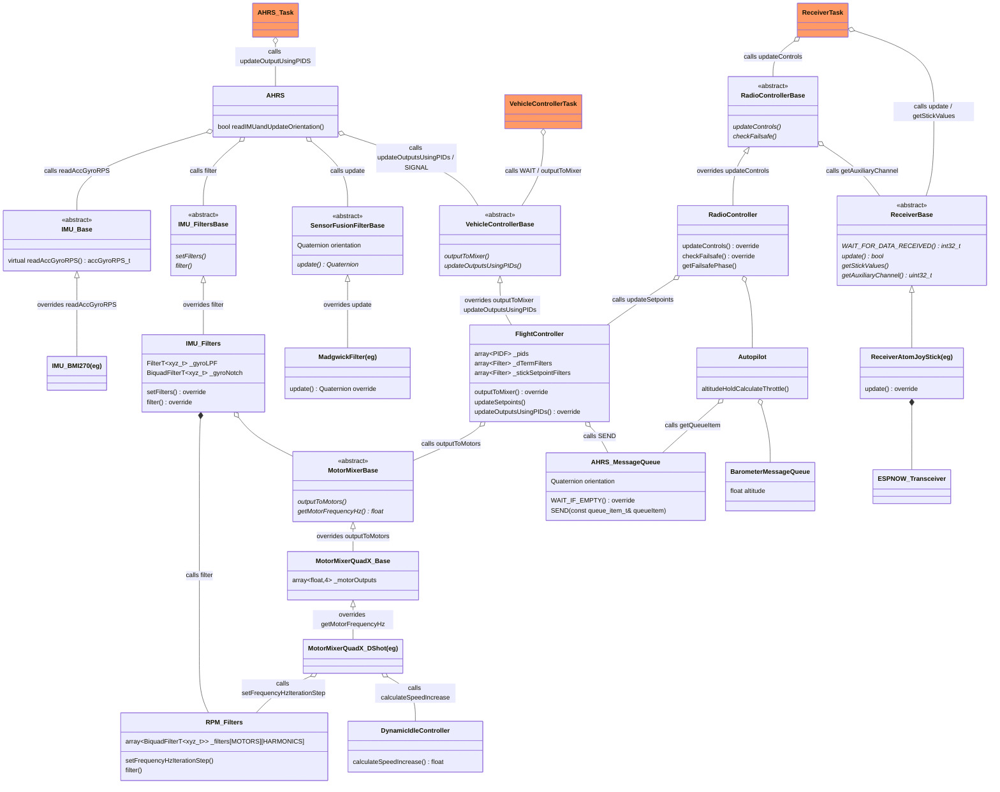

```mermaid
classDiagram
    class AHRS {
        bool readIMUandUpdateOrientation()
    }
    link AHRS "https://github.com/martinbudden/Library-StabilizedVehicle/blob/main/src/AHRS.h"
    AHRS o-- IMU_Base : calls readAccGyroRPS
    AHRS o-- IMU_FiltersBase : calls filter
    AHRS o-- SensorFusionFilterBase : calls update
    class AHRS_Task:::taskClass {
    }
    link AHRS_Task "https://github.com/martinbudden/Library-StabilizedVehicle/blob/main/src/AHRS_Task.h"
    AHRS_Task o-- AHRS : calls updateOutputUsingPIDS

    VehicleControllerBase <|-- FlightController : overrides outputToMixer updateOutputsUsingPIDs
    AHRS o-- VehicleControllerBase : calls updateOutputsUsingPIDs / SIGNAL
    class ReceiverTask:::taskClass {
    }
    class SensorFusionFilterBase {
        Quaternion orientation
        <<abstract>>
        update() Quaternion *
    }
    link SensorFusionFilterBase "https://github.com/martinbudden/Library-SensorFusion/blob/main/src/SensorFusion.h"

    class IMU_Base {
        <<abstract>>
        virtual readAccGyroRPS() accGyroRPS_t
    }
    link IMU_Base "https://github.com/martinbudden/Library-IMU/blob/main/src/IMU_Base.h"

    class IMU_FiltersBase {
        <<abstract>>
        setFilters() *
        filter() *
    }
    link IMU_FiltersBase "https://github.com/martinbudden/Library-StabilizedVehicle/blob/main/src/IMU_FiltersBase.h"

    class VehicleControllerBase {
        <<abstract>>
        outputToMixer() *
        updateOutputsUsingPIDs() *
    }
    link VehicleControllerBase "https://github.com/martinbudden/Library-StabilizedVehicle/blob/main/src/VehicleControllerBase.h"

    class MotorMixerBase {
        <<abstract>>
        outputToMotors() *
        getMotorFrequencyHz() float *
    }
    link FlightController "https://github.com/martinbudden/protoflight/blob/main/lib/MotorMixers/src/MotorMixerBase.h"
    MotorMixerBase <|-- MotorMixerQuadX_Base : overrides outputToMotors

    class VehicleControllerTask:::taskClass {
    }
    link VehicleControllerTask "https://github.com/martinbudden/Library-StabilizedVehicle/blob/main/src/VehicleControllerTask.h"
    VehicleControllerTask o-- VehicleControllerBase : calls WAIT / outputToMixer

    class AHRS_MessageQueue {
        Quaternion orientation
        WAIT_IF_EMPTY() override
        SEND(const queue_item_t& queueItem)
    }
    link AHRS_MessageQueue "https://github.com/martinbudden/protoflight/blob/main/lib/Blackbox/src/AHRS_MessageQueue.h"

    class FlightController {
        array~PIDF~ _pids
        array~Filter~ _dTermFilters
        array~Filter~ _stickSetpointFilters
        outputToMixer() override
        updateSetpoints()
        updateOutputsUsingPIDs() override
    }
    link FlightController "https://github.com/martinbudden/protoflight/blob/main/lib/FlightController/src/FlightController.h"
    RadioController o-- FlightController : calls updateSetpoints
    FlightController o-- MotorMixerBase : calls outputToMotors
    FlightController o-- AHRS_MessageQueue : calls SEND

    class ReceiverBase {
        <<abstract>>
        WAIT_FOR_DATA_RECEIVED() int32_t *
        update() bool *
        getStickValues() *
        getAuxiliaryChannel() uint32_t *
    }
    link ReceiverBase "https://github.com/martinbudden/Library-Receiver/blob/main/src/ReceiverBase.h"

    class RadioControllerBase {
        <<abstract>>
        updateControls() *
        checkFailsafe() *
    }
    link RadioControllerBase "https://github.com/martinbudden/Library-Receiver/blob/main/src/RadioControllerBase.h"

    ReceiverTask o-- RadioControllerBase : calls updateControls
    ReceiverTask o-- ReceiverBase : calls update / getStickValues
    link ReceiverTask "https://github.com/martinbudden/Library-Receiver/blob/main/src/ReceiverTask.h"
    %%RadioControllerBase --o ReceiverTask : calls updateControls

    RadioControllerBase <|-- RadioController : overrides updateControls
    RadioControllerBase o--ReceiverBase : calls getAuxiliaryChannel
    class RadioController {
        updateControls() override
        checkFailsafe() override
        getFailsafePhase()
    }
    link RadioController "https://github.com/martinbudden/protoflight/blob/main/lib/FlightController/src/RadioController.h"
    RadioController o-- Autopilot
    class Autopilot {
        altitudeHoldCalculateThrottle()
    }
    link FlightController "https://github.com/martinbudden/protoflight/blob/main/lib/FlightController/src/Autopilot.h"
    Autopilot o-- AHRS_MessageQueue : calls getQueueItem
    class BarometerMessageQueue {
        float altitude
    }
    Autopilot o -- BarometerMessageQueue

    class RPM_Filters {
        array~BiquadFilterT~xyz_t~~ _filters[MOTORS][HARMONICS]
        setFrequencyHzIterationStep()
        filter()
    }
    link RPM_Filters "https://github.com/martinbudden/protoflight/blob/main/lib/FlightController/src/RPM_Filters.h"

    IMU_FiltersBase <|-- IMU_Filters : overrides filter
    class IMU_Filters {
        FilterT~xyz_t~  _gyroLPF
        BiquadFilterT~xyz_t~ _gyroNotch
        setFilters() override
        filter() override
    }
    link IMU_Filters "https://github.com/martinbudden/protoflight/blob/main/lib/FlightController/src/IMU_Filters.h"
    IMU_Filters *-- RPM_Filters : calls filter
    IMU_Filters o-- MotorMixerBase

    MotorMixerQuadX_Base <|-- MotorMixerQuadX_DShot : overrides getMotorFrequencyHz
    class MotorMixerQuadX_Base {
        array~float,4~ _motorOutputs
    }
    link MotorMixerQuadX_Base "https://github.com/martinbudden/protoflight/blob/main/lib/MotorMixers/src/MotorMixerQuadX_Base.h"

    class DynamicIdleController {
        calculateSpeedIncrease() float
    }
    link DynamicIdleController "https://github.com/martinbudden/protoflight/blob/main/lib/MotorMixers/src/DynamicIdleController.h"
    class MotorMixerQuadX_DShot["MotorMixerQuadX_DShot(eg)"]
    link MotorMixerQuadX_DShot "https://github.com/martinbudden/protoflight/blob/main/lib/MotorMixers/src/MotorMixerQuadX_DShot.h"
    MotorMixerQuadX_DShot o-- RPM_Filters : calls setFrequencyHzIterationStep
    MotorMixerQuadX_DShot o-- DynamicIdleController : calls calculateSpeedIncrease

    IMU_Base <|-- IMU_BMI270 : overrides readAccGyroRPS
    class IMU_BMI270["IMU_BMI270(eg)"]
    link IMU_BMI270 "https://github.com/martinbudden/Library-IMU/blob/main/src/IMU_BMI270.h"

    SensorFusionFilterBase  <|-- MadgwickFilter : overrides  update
    class MadgwickFilter["MadgwickFilter(eg)"] {
        update() Quaternion override
    }
    link MadgwickFilter "https://github.com/martinbudden/Library-SensorFusion/blob/main/src/SensorFusion.h"

    class ReceiverAtomJoyStick {
        update() override
    }
    ReceiverBase <|-- ReceiverAtomJoyStick
    class ReceiverAtomJoyStick["ReceiverAtomJoyStick(eg)"]
    link ReceiverAtomJoyStick "https://github.com/martinbudden/Library-Receiver/blob/main/src/ReceiverAtomJoyStick.h"
    ReceiverAtomJoyStick *-- ESPNOW_Transceiver
    class ESPNOW_Transceiver
    link ESPNOW_Transceiver "https://github.com/martinbudden/Library-Receiver/blob/main/src/ESPNOW_Transceiver.h"

    classDef taskClass fill:#f96
```
