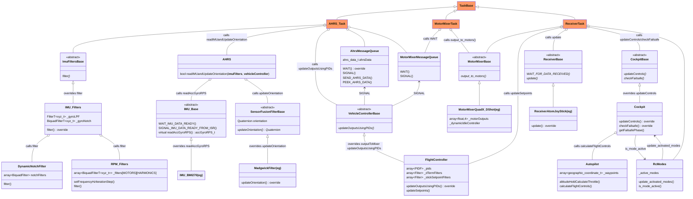

```mermaid
---
  config:
    class:
      hideEmptyMembersBox: true
---
classDiagram
    class TaskBase:::taskClass {
    }
    link TaskBase "https://github.com/martinbudden/Library-TaskBase/blob/main/src/task_base.h"
    TaskBase <|-- AHRS_Task
    TaskBase <|-- MotorMixerTask
    TaskBase <|-- ReceiverTask

    class AHRS_Task:::taskClass {
    }
    link AHRS_Task "https://github.com/martinbudden/Library-StabilizedVehicle/blob/main/src/AHRS_Task.h"
    AHRS_Task o-- ImuFiltersBase
    AHRS_Task o-- AHRS : calls readIMUandUpdateOrientation
    AHRS_Task o-- VehicleControllerBase : calls updateOutputsUsingPIDs
    AHRS_Task o-- AhrsMessageQueue
    AHRS_Task o-- MotorMixerMessageQueue

    class IMU_Base {
        <<abstract>>
        WAIT_IMU_DATA_READY()
        SIGNAL_IMU_DATA_READY_FROM_ISR()
        virtual readAccGyroRPS() accGyroRPS_t
    }
    link IMU_Base "https://github.com/martinbudden/Library-Sensors/blob/main/src/IMU_Base.h"

    IMU_Base <|-- IMU_BMI270 : overrides readAccGyroRPS
    class IMU_BMI270["IMU_BMI270(eg)"]
    link IMU_BMI270 "https://github.com/martinbudden/Library-Sensors/blob/main/src/IMU_BMI270.h"

    class ImuFiltersBase {
        <<abstract>>
        filter() *
    }
    link ImuFiltersBase "https://github.com/martinbudden/Library-StabilizedVehicle/blob/main/src/ImuFiltersBase.h"

    class DynamicNotchFilter {
        array~BiquadFilter~ notchFilters
        filter()
    }
    link DynamicNotchFilter "https://github.com/martinbudden/protoflight/blob/main/lib/FlightController/src/DynamicNotchFilter.h"

    class RPM_Filters {
        array~BiquadFilterT~xyz_t~~ _filters[MOTORS][HARMONICS]
        setFrequencyHzIterationStep()
        filter()
    }
    link RPM_Filters "https://github.com/martinbudden/protoflight/blob/main/lib/FlightController/src/RPM_Filters.h"

    class IMU_Filters {
        FilterT~xyz_t~  _gyroLPF
        BiquadFilterT~xyz_t~ _gyroNotch
        filter() override
    }
    link IMU_Filters "https://github.com/martinbudden/protoflight/blob/main/lib/FlightController/src/IMU_Filters.h"
    IMU_Filters o-- DynamicNotchFilter : calls filter
    %%DynamicNotchFilter --o IMU_Filters : calls filter
    IMU_Filters o-- RPM_Filters : calls filter
    ImuFiltersBase <|-- IMU_Filters : overrides filter

    class SensorFusionFilterBase {
        Quaternion orientation
        <<abstract>>
        updateOrientation() Quaternion *
    }
    link SensorFusionFilterBase "https://github.com/martinbudden/Library-SensorFusion/blob/main/src/sensor_fusion.h"

    SensorFusionFilterBase  <|-- MadgwickFilter : overrides updateOrientation
    class MadgwickFilter["MadgwickFilter(eg)"] {
        updateOrientation() override
    }
    link MadgwickFilter "https://github.com/martinbudden/Library-SensorFusion/blob/main/src/sensor_fusion.h"

    class AHRS {
        bool readIMUandUpdateOrientation(**imuFilters**, **vehicleController**)
    }
    link AHRS "https://github.com/martinbudden/Library-StabilizedVehicle/blob/main/src/ahrs.h"
    AHRS o-- IMU_Base : calls readAccGyroRPS
    AHRS o-- SensorFusionFilterBase : calls updateOrientation

    class VehicleControllerBase {
        <<abstract>>
        updateOutputsUsingPIDs() *
    }
    link VehicleControllerBase "https://github.com/martinbudden/Library-StabilizedVehicle/blob/main/src/vehicle_controller_base.h"

    class MotorMixerTask:::taskClass {
    }
    link MotorMixerTask "https://github.com/martinbudden/Library-MotorMixer/blob/main/src/motor_mixer_task.h"
    MotorMixerTask o-- MotorMixerMessageQueue : calls WAIT
    MotorMixerTask o-- MotorMixerBase : calls output_to_motors()

    class MotorMixerMessageQueue {
        WAIT()
        SIGNAL()
    }
    link MotorMixerMessageQueue "https://github.com/martinbudden/Library-StabilizedVehicle/blob/main/src/motor_mixer_message_queue.h"
    MotorMixerMessageQueue <-- VehicleControllerBase : SIGNAL
    AhrsMessageQueue <-- VehicleControllerBase : SIGNAL


    class MotorMixerBase {
        <<abstract>>
        output_to_motors() *
    }
    link MotorMixerBase "https://github.com/martinbudden/protoflight/blob/main/lib/MotorMixers/src/motor_mixer_base.h"


    MotorMixerBase <|-- MotorMixerQuadX_DShot
    class MotorMixerQuadX_DShot["MotorMixerQuadX_DShot(eg)"] {
        array~float,4~ _motorOutputs
        _dynamicIdleController
    }
    link MotorMixerQuadX_DShot "https://github.com/martinbudden/protoflight/blob/main/lib/MotorMixers/src/MotorMixerQuadX_DShot.h"

    class FlightController {
        array~PIDF~ _pids
        array~Filter~ _dTermFilters
        array~Filter~ _stickSetpointFilters
        updateOutputsUsingPIDs() override
        updateSetpoints()
    }
    link FlightController "https://github.com/martinbudden/protoflight/blob/main/lib/FlightController/src/FlightController.h"
    VehicleControllerBase <|-- FlightController : overrides outputToMixer updateOutputsUsingPIDs

    class CockpitBase {
        <<abstract>>
        updateControls() *
        checkFailsafe() *
    }
    link CockpitBase "https://github.com/martinbudden/Library-Receiver/blob/main/src/CockpitBase.h"
    CockpitBase <|-- Cockpit : overrides updateControls

    class Cockpit {
        updateControls() override
        checkFailsafe() override
        getFailsafePhase()
    }
    link Cockpit "https://github.com/martinbudden/protoflight/blob/main/lib/Helm/src/Cockpit.h"
    Cockpit o-- Autopilot : calls calculateFlightControls
    Cockpit --> RcModes : is_mode_active
    RcModes --> Cockpit : update_activated_modes

    class RcModes {
        update_activated_modes()
        is_mode_active()
        _active_modes
    }
    %%RcModes <-- Cockpit : is_mode_active

    class ReceiverTask:::taskClass {
    }
    link ReceiverTask "https://github.com/martinbudden/Library-Receiver/blob/main/src/ReceiverTask.h"

    ReceiverTask o-- MotorMixerBase
    ReceiverTask o-- FlightController : calls updateSetpoints
    ReceiverTask o-- ReceiverBase : calls update
    ReceiverTask o-- CockpitBase : calls updateControls/checkFailsafe
    ReceiverTask o-- RcModes
    %%CockpitBase --o ReceiverTask : calls updateControls

    class Autopilot {
        array~geographic_coordinate_t~ _waypoints
        altitudeHoldCalculateThrottle()
        calculateFlightControls()
    }
    link Autopilot "https://github.com/martinbudden/protoflight/blob/main/lib/Helm/src/Autopilot.h"

    class AhrsMessageQueue {
        ahrs_data_t ahrsData
        WAIT() override
        SIGNAL()
        SEND_AHRS_DATA()
        PEEK_AHRS_DATA()
    }
    link AhrsMessageQueue "https://github.com/martinbudden/Library-StabilizedVehicle/blob/main/src/AhrsMessageQueue.h"

    class ReceiverBase {
        <<abstract>>
        WAIT_FOR_DATA_RECEIVED() *
        update() *
    }
    link ReceiverBase "https://github.com/martinbudden/Library-Receiver/blob/main/src/ReceiverBase.h"
    class ReceiverAtomJoyStick {
        update() override
    }
    ReceiverBase <|-- ReceiverAtomJoyStick
    class ReceiverAtomJoyStick["ReceiverAtomJoyStick(eg)"]
    link ReceiverAtomJoyStick "https://github.com/martinbudden/Library-Receiver/blob/main/src/ReceiverAtomJoyStick.h"

    classDef taskClass fill:#f96
```
