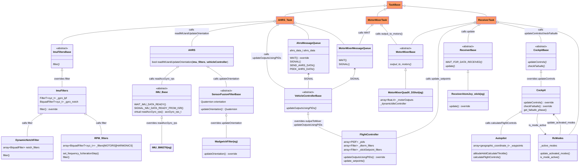

```mermaid
---
  config:
    class:
      hideEmptyMembersBox: true
---
classDiagram
    class TaskBase:::taskClass {
    }
    link TaskBase "https://github.com/martinbudden/Library-TaskBase/blob/main/src/task_base.h"
    TaskBase <|-- AHRS_Task
    TaskBase <|-- MotorMixerTask
    TaskBase <|-- ReceiverTask

    class AHRS_Task:::taskClass {
    }
    link AHRS_Task "https://github.com/martinbudden/Library-StabilizedVehicle/blob/main/src/AHRS_Task.h"
    AHRS_Task o-- ImuFiltersBase
    AHRS_Task o-- AHRS : calls readIMUandUpdateOrientation
    AHRS_Task o-- VehicleControllerBase : calls updateOutputsUsingPIDs
    AHRS_Task o-- AhrsMessageQueue
    AHRS_Task o-- MotorMixerMessageQueue

    class IMU_Base {
        <<abstract>>
        WAIT_IMU_DATA_READY()
        SIGNAL_IMU_DATA_READY_FROM_ISR()
        virtual readAccGyro_rps() accGyro_rps_t
    }
    link IMU_Base "https://github.com/martinbudden/Library-Sensors/blob/main/src/imu_base.h"

    IMU_Base <|-- IMU_BMI270 : overrides readAccGyro_rps
    class IMU_BMI270["IMU_BMI270(eg)"]
    link IMU_BMI270 "https://github.com/martinbudden/Library-Sensors/blob/main/src/IMU_BMI270.h"

    class ImuFiltersBase {
        <<abstract>>
        filter() *
    }
    link ImuFiltersBase "https://github.com/martinbudden/Library-StabilizedVehicle/blob/main/src/ImuFiltersBase.h"

    class DynamicNotchFilter {
        array~BiquadFilter~ notch_filters
        filter()
    }
    link DynamicNotchFilter "https://github.com/martinbudden/protoflight/blob/main/lib/FlightController/src/dynamic_notch_filter.h"

    class RPM_filters {
        array~BiquadFilterT~xyz_t~~ _filters[MOTORS][HARMONICS]
        set_frequency_hzIterationStep()
        filter()
    }
    link RPM_filters "https://github.com/martinbudden/protoflight/blob/main/lib/FlightController/src/RPM_filters.h"

    class ImuFilters {
        FilterT~xyz_t~  _gyro_lpf
        BiquadFilterT~xyz_t~ _gyro_notch
        filter() override
    }
    link ImuFilters "https://github.com/martinbudden/protoflight/blob/main/lib/FlightController/src/imu_filters.h"
    ImuFilters o-- DynamicNotchFilter : calls filter
    %%DynamicNotchFilter --o ImuFilters : calls filter
    ImuFilters o-- RPM_filters : calls filter
    ImuFiltersBase <|-- ImuFilters : overrides filter

    class SensorFusionFilterBase {
        Quaternion orientation
        <<abstract>>
        updateOrientation() Quaternion *
    }
    link SensorFusionFilterBase "https://github.com/martinbudden/Library-SensorFusion/blob/main/src/sensor_fusion.h"

    SensorFusionFilterBase  <|-- MadgwickFilter : overrides updateOrientation
    class MadgwickFilter["MadgwickFilter(eg)"] {
        updateOrientation() override
    }
    link MadgwickFilter "https://github.com/martinbudden/Library-SensorFusion/blob/main/src/sensor_fusion.h"

    class AHRS {
        bool readIMUandUpdateOrientation(**imu_filters**, **vehicleController**)
    }
    link AHRS "https://github.com/martinbudden/Library-StabilizedVehicle/blob/main/src/ahrs.h"
    AHRS o-- IMU_Base : calls readAccGyro_rps
    AHRS o-- SensorFusionFilterBase : calls updateOrientation

    class VehicleControllerBase {
        <<abstract>>
        updateOutputsUsingPIDs() *
    }
    link VehicleControllerBase "https://github.com/martinbudden/Library-StabilizedVehicle/blob/main/src/vehicle_controller_base.h"

    class MotorMixerTask:::taskClass {
    }
    link MotorMixerTask "https://github.com/martinbudden/Library-MotorMixer/blob/main/src/motor_mixer_task.h"
    MotorMixerTask o-- MotorMixerMessageQueue : calls WAIT
    MotorMixerTask o-- MotorMixerBase : calls output_to_motors()

    class MotorMixerMessageQueue {
        WAIT()
        SIGNAL()
    }
    link MotorMixerMessageQueue "https://github.com/martinbudden/Library-StabilizedVehicle/blob/main/src/motor_mixer_message_queue.h"
    MotorMixerMessageQueue <-- VehicleControllerBase : SIGNAL
    AhrsMessageQueue <-- VehicleControllerBase : SIGNAL


    class MotorMixerBase {
        <<abstract>>
        output_to_motors() *
    }
    link MotorMixerBase "https://github.com/martinbudden/protoflight/blob/main/lib/MotorMixers/src/motor_mixer_base.h"


    MotorMixerBase <|-- MotorMixerQuadX_DShot
    class MotorMixerQuadX_DShot["MotorMixerQuadX_DShot(eg)"] {
        array~float,4~ _motorOutputs
        _dynamicIdleController
    }
    link MotorMixerQuadX_DShot "https://github.com/martinbudden/protoflight/blob/main/lib/MotorMixers/src/MotorMixerQuadX_DShot.h"

    class FlightController {
        array~PIDF~ _pids
        array~Filter~ _dterm_filters
        array~Filter~ _stickSetpoint_filters
        updateOutputsUsingPIDs() override
        update_setpoints()
    }
    link FlightController "https://github.com/martinbudden/protoflight/blob/main/lib/FlightController/src/flight_controller.h"
    VehicleControllerBase <|-- FlightController : overrides outputToMixer updateOutputsUsingPIDs

    class CockpitBase {
        <<abstract>>
        updateControls() *
        checkFailsafe() *
    }
    link CockpitBase "https://github.com/martinbudden/Library-Receiver/blob/main/src/CockpitBase.h"
    CockpitBase <|-- Cockpit : overrides updateControls

    class Cockpit {
        updateControls() override
        checkFailsafe() override
        get_failsafe_phase()
    }
    link Cockpit "https://github.com/martinbudden/protoflight/blob/main/lib/Helm/src/cockpit.h"
    Cockpit o-- Autopilot : calls calculateFlightControls
    Cockpit --> RcModes : is_mode_active
    RcModes --> Cockpit : update_activated_modes

    class RcModes {
        update_activated_modes()
        is_mode_active()
        _active_modes
    }
    %%RcModes <-- Cockpit : is_mode_active

    class ReceiverTask:::taskClass {
    }
    link ReceiverTask "https://github.com/martinbudden/Library-Receiver/blob/main/src/ReceiverTask.h"

    ReceiverTask o-- MotorMixerBase
    ReceiverTask o-- FlightController : calls update_setpoints
    ReceiverTask o-- ReceiverBase : calls update
    ReceiverTask o-- CockpitBase : calls updateControls/checkFailsafe
    ReceiverTask o-- RcModes
    %%CockpitBase --o ReceiverTask : calls updateControls

    class Autopilot {
        array~geographic_coordinate_t~ _waypoints
        altitudeHoldCalculateThrottle()
        calculateFlightControls()
    }
    link Autopilot "https://github.com/martinbudden/protoflight/blob/main/lib/Helm/src/autopilot.h"

    class AhrsMessageQueue {
        ahrs_data_t ahrs_data
        WAIT() override
        SIGNAL()
        SEND_AHRS_DATA()
        PEEK_AHRS_DATA()
    }
    link AhrsMessageQueue "https://github.com/martinbudden/Library-StabilizedVehicle/blob/main/src/AhrsMessageQueue.h"

    class ReceiverBase {
        <<abstract>>
        WAIT_FOR_DATA_RECEIVED() *
        update() *
    }
    link ReceiverBase "https://github.com/martinbudden/Library-Receiver/blob/main/src/ReceiverBase.h"
    class ReceiverAtomJoy_stick {
        update() override
    }
    ReceiverBase <|-- ReceiverAtomJoy_stick
    class ReceiverAtomJoy_stick["ReceiverAtomJoy_stick(eg)"]
    link ReceiverAtomJoy_stick "https://github.com/martinbudden/Library-Receiver/blob/main/src/ReceiverAtomJoy_stick.h"

    classDef taskClass fill:#f96
```
